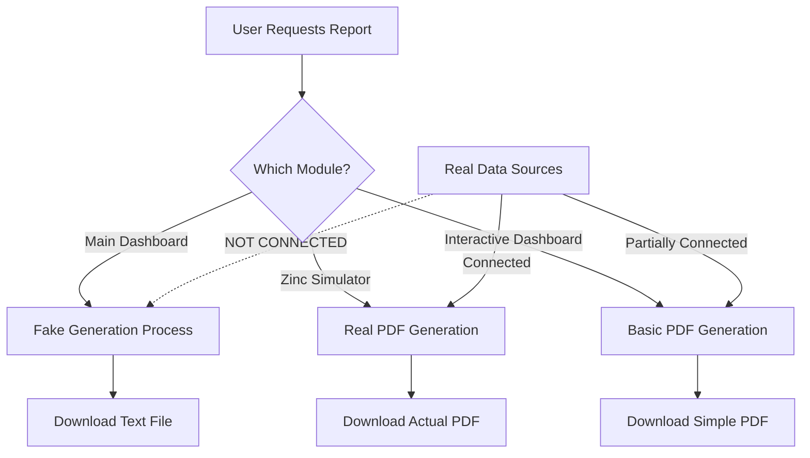

# Comprehensive Report Generation Analysis
## Uganda Nutrition Intervention Platform

---

## Executive Summary

This analysis examines the report generation capabilities of the Uganda Nutrition Intervention Platform, comparing the current implementation against ideal requirements for a production-ready system. The platform currently has **partial and inconsistent** report generation functionality, with the main dashboard (`uganda_nutrition_enhanced.py`) using placeholder implementations while auxiliary modules have more complete PDF generation capabilities.

**Key Finding:** The main dashboard requires significant enhancement to deliver actual PDF reports with real data integration, despite having ReportLab already imported and configured.

---

## 1. Current State Assessment

### 1.1 Implementation Status by Module

#### **uganda_nutrition_enhanced.py (Main Dashboard)**
- **Status:** ❌ **Placeholder Implementation Only**
- **Capabilities:**
  - ReportLab libraries imported but unused
  - Mock report generation with fake progress indicators
  - Downloads only "Sample {report_type} Content" text
  - No actual PDF creation
  - No real data integration
  - Simulated 5-step generation process with sleep timers

**Code Evidence (lines 4744-4769):**
```python
if st.button("Generate Report", type="primary", key="generate_report"):
    # Only creates fake progress and downloads sample text
    report_data = f"Sample {report_type} Content"
    b64 = base64.b64encode(report_data.encode()).decode()
    href = f'<a href="data:file/txt;base64,{b64}" download="uganda_nutrition_report.{report_format.lower()}">'
```

#### **zinc_intervention_simulator_enhanced.py**
- **Status:** ✅ **Fully Implemented**
- **Capabilities:**
  - Complete PDF generation with ReportLab
  - Three document types: Planning Template, M&E Framework, Policy Brief
  - Professional formatting with tables, styles, colors
  - Structured content sections
  - BytesIO buffer for in-memory PDF creation
  - Direct download buttons with actual PDF files

**Key Features:**
- Custom paragraph styles with branding colors
- Multi-page documents with page breaks
- Formatted tables with TableStyle
- Professional layout and typography

#### **uganda_nutrition_interactive.py**
- **Status:** ⚠️ **Partially Implemented**
- **Capabilities:**
  - Basic PDF generation functionality
  - Some real content integration
  - Executive summary with actual metrics
  - Priority districts table
  - Recommendations section
  - Limited to single report type

### 1.2 Current Data Flow



### 1.3 Available Report Types (Configured but Not Implemented)

The main dashboard UI shows options for:
- Executive Summary
- Technical Report  
- Donor Report
- Impact Assessment
- Financial Analysis

However, **none of these actually generate different content** - all produce the same placeholder text.

---

## 2. Ideal Report Generation Requirements

### 2.1 Core Functional Requirements

#### **Data Integration**
- ✅ Real-time data from all sources:
  - Uganda census data (47.8M population)
  - District-level metrics (130 districts)
  - Health facility data
  - Nutrition survey results
  - Intervention outcomes
  - Budget allocations
  - Supply chain metrics

#### **Content Generation**
- ✅ Dynamic sections based on actual analysis:
  - Executive summary with key metrics
  - Current situation analysis
  - District prioritization matrices
  - Intervention strategy details
  - Budget breakdown and allocation
  - Impact projections with models
  - Cost-effectiveness analysis
  - Implementation timeline
  - Risk assessment
  - Monitoring & evaluation framework
  - Recommendations

#### **Visualization Integration**
- ✅ Embedded charts and graphs:
  - Coverage maps
  - Trend analysis charts
  - Budget allocation pie charts
  - Impact projection graphs
  - District comparison tables
  - Supply chain network diagrams

### 2.2 Report Types and Stakeholders

| Report Type | Primary Audience | Key Content | Format Priority |
|------------|-----------------|-------------|-----------------|
| Executive Summary | Policy Makers, Donors | High-level metrics, ROI, Impact | PDF, PowerPoint |
| Technical Report | Implementation Teams | Detailed methodology, Data tables | PDF, Excel |
| Donor Report | Funding Partners | Financial accountability, Outcomes | PDF, Word |
| Impact Assessment | Evaluators | Before/after analysis, DALYs | PDF, Interactive |
| Financial Analysis | Investors | Cost-benefit, Projections | Excel, PDF |
| District Report | Local Officials | Localized data, Actions | PDF, Print-ready |
| M&E Report | Program Managers | KPIs, Progress tracking | PDF, Dashboard |

### 2.3 Technical Requirements

#### **PDF Generation Engine**
```python
class ReportGenerator:
    def __init__(self):
        self.data_provider = UgandaRealDataProvider()
        self.styles = self._create_style_sheet()
        self.templates = self._load_templates()
    
    def generate_report(self, report_type, parameters):
        # 1. Fetch real data
        data = self._collect_data(parameters)
        
        # 2. Process and analyze
        analysis = self._run_analysis(data)
        
        # 3. Generate visualizations
        charts = self._create_visualizations(analysis)
        
        # 4. Build PDF document
        pdf = self._build_pdf(report_type, analysis, charts)
        
        # 5. Add metadata and security
        pdf = self._add_metadata(pdf, parameters)
        
        return pdf
```

#### **Multi-format Export**
- PDF (primary, with full formatting)
- Excel (data tables and calculations)
- Word (editable narratives)
- PowerPoint (presentation-ready)
- HTML (web viewing)
- CSV (raw data export)

### 2.4 Quality Requirements

#### **Performance**
- Report generation < 30 seconds for standard reports
- Async generation for large reports
- Progress tracking with meaningful updates
- Caching of frequently used data

#### **Reliability**
- Error handling for missing data
- Fallback to cached reports if generation fails
- Validation of all inputs
- Audit trail of report generation

#### **Usability**
- Template customization
- Scheduled report generation
- Batch report creation
- Email delivery option
- Report versioning and history

---

## 3. Gap Analysis

### 3.1 Critical Gaps

| Component | Current State | Required State | Gap Severity |
|-----------|--------------|----------------|--------------|
| **Data Integration** | No connection to real data | Full integration with all sources | 🔴 Critical |
| **PDF Generation** | Placeholder text only | Complete PDF with all sections | 🔴 Critical |
| **Content Creation** | Static sample text | Dynamic based on analysis | 🔴 Critical |
| **Visualizations** | None | Embedded charts and maps | 🟡 Major |
| **Multi-format** | Text file only | PDF, Excel, Word, PPT | 🟡 Major |
| **Report Types** | UI only, no differentiation | Distinct templates per type | 🟡 Major |
| **Scheduling** | Not available | Automated generation | 🟠 Moderate |
| **Versioning** | Not implemented | Full audit trail | 🟠 Moderate |

### 3.2 Code Architecture Issues

1. **Inconsistent Implementation**: Different modules use different approaches
2. **No Shared Components**: Each module reimplements PDF generation
3. **Missing Abstraction Layer**: No central ReportGenerator class
4. **Hard-coded Content**: Even in working implementations, content is often static
5. **No Template System**: Reports are built programmatically without templates

### 3.3 Missing Core Functions

```python
# These functions exist in code but are never properly called:
- generate_monitoring_metrics()  # Returns data but not used in reports
- generate_comparison_insights()  # Creates insights but not integrated
- generate_budget_optimization_curve()  # Analysis not in reports
- generate_planning_template()  # Returns dict but not converted to PDF
- generate_me_framework()  # Framework data not rendered
```

---

## 4. Implementation Roadmap

### 4.1 Phase 1: Foundation (Week 1-2)
**Objective:** Create core report generation infrastructure

```python
# 1. Create central report generator
class UgandaNutritionReportGenerator:
    def __init__(self):
        self.real_data_provider = UgandaRealDataProvider()
        self.intervention_engine = InterventionEngine()
        self.styles = self._initialize_styles()
    
    def generate_executive_summary(self, parameters):
        # Implementation with real data
        pass
    
    def generate_technical_report(self, parameters):
        # Detailed technical implementation
        pass
```

**Tasks:**
- [ ] Create ReportGenerator base class
- [ ] Implement data collection methods
- [ ] Set up ReportLab document templates
- [ ] Create standard style sheets
- [ ] Build section generators

### 4.2 Phase 2: Data Integration (Week 3-4)
**Objective:** Connect all data sources to report generation

```python
def _collect_report_data(self, report_params):
    return {
        'population_data': self.real_data_provider.get_population_data(),
        'nutrition_metrics': self.real_data_provider.get_nutrition_indicators(),
        'intervention_results': self.intervention_engine.get_results(),
        'budget_allocation': self.get_budget_data(),
        'supply_chain': self.get_supply_metrics(),
        'monitoring_data': generate_monitoring_metrics(...)
    }
```

**Tasks:**
- [ ] Wire up real_data_provider
- [ ] Connect intervention engine results
- [ ] Integrate monitoring metrics
- [ ] Add supply chain data
- [ ] Include financial calculations

### 4.3 Phase 3: Report Templates (Week 5-6)
**Objective:** Implement all report types with proper templates

**Executive Summary Template:**
```python
def _build_executive_summary(self, data):
    story = []
    
    # Title Page
    story.append(self._create_title_page(
        "Uganda Nutrition Intervention Program",
        "Executive Summary",
        data['metadata']
    ))
    
    # Key Metrics Dashboard
    story.append(self._create_metrics_dashboard(data))
    
    # Coverage Map
    story.append(self._create_coverage_map(data))
    
    # Financial Summary
    story.append(self._create_financial_summary(data))
    
    # Recommendations
    story.append(self._create_recommendations(data))
    
    return story
```

### 4.4 Phase 4: Visualization Integration (Week 7-8)
**Objective:** Add charts and visual elements to reports

```python
def _create_chart_element(self, chart_type, data):
    # Generate chart with plotly
    fig = self._generate_plotly_chart(chart_type, data)
    
    # Convert to image
    img_buffer = fig.to_image(format='png')
    
    # Embed in PDF
    return Image(img_buffer, width=6*inch, height=4*inch)
```

### 4.5 Phase 5: Production Features (Week 9-10)
**Objective:** Add enterprise features

- [ ] Implement caching layer
- [ ] Add async generation for large reports
- [ ] Create scheduling system
- [ ] Build version control
- [ ] Add email delivery
- [ ] Implement access controls
- [ ] Create audit logging

---

## 5. Recommended Implementation

### 5.1 Immediate Actions (This Week)

1. **Fix the main dashboard report generation:**

```python
# In uganda_nutrition_enhanced.py, replace lines 4745-4769:

if st.button("Generate Report", type="primary", key="generate_report"):
    with st.spinner(f"Generating {report_type}..."):
        # Use the existing zinc pattern as reference
        buffer = BytesIO()
        doc = SimpleDocTemplate(buffer, pagesize=A4)
        story = []
        
        # Build actual content
        story = build_report_content(
            report_type=report_type,
            data=collect_real_data(),
            period=report_period,
            format=report_format
        )
        
        # Generate PDF
        doc.build(story)
        buffer.seek(0)
        
        # Provide download
        st.download_button(
            label=f"📥 Download {report_type}",
            data=buffer,
            file_name=f"uganda_nutrition_{report_type.lower()}_{datetime.now():%Y%m%d}.pdf",
            mime="application/pdf"
        )
```

2. **Create shared report utilities:**

```python
# New file: report_generator.py

from reportlab.platypus import SimpleDocTemplate, Table, TableStyle, Paragraph
from reportlab.lib import colors
from reportlab.lib.pagesizes import A4, letter
import pandas as pd
from datetime import datetime

class UgandaReportGenerator:
    """Centralized report generation for all modules"""
    
    def __init__(self):
        self.setup_styles()
        self.load_data_providers()
    
    def generate_report(self, report_type, **params):
        """Main entry point for report generation"""
        
        # Map report types to generators
        generators = {
            'executive': self._generate_executive_summary,
            'technical': self._generate_technical_report,
            'donor': self._generate_donor_report,
            'impact': self._generate_impact_assessment,
            'financial': self._generate_financial_analysis
        }
        
        generator = generators.get(report_type, self._generate_executive_summary)
        return generator(**params)
```

### 5.2 Testing Strategy

```python
# test_report_generation.py

def test_report_generation():
    """Comprehensive test suite for report generation"""
    
    generator = UgandaReportGenerator()
    
    # Test each report type
    for report_type in ['executive', 'technical', 'donor']:
        
        # Generate report
        pdf_buffer = generator.generate_report(
            report_type=report_type,
            districts=['Kampala', 'Gulu'],
            period='2024-Q1'
        )
        
        # Validate PDF
        assert pdf_buffer is not None
        assert len(pdf_buffer.getvalue()) > 1000  # Not empty
        
        # Check for required sections
        pdf_content = extract_pdf_text(pdf_buffer)
        assert 'Executive Summary' in pdf_content
        assert 'Recommendations' in pdf_content
        
    print("✅ All report generation tests passed")
```

---

## 6. Conclusion

The Uganda Nutrition Intervention Platform's report generation capability is currently **not production-ready**. While the infrastructure (ReportLab) is in place and some modules demonstrate working PDF generation, the main dashboard - which should be the primary report generation interface - only provides placeholder functionality.

### Critical Next Steps:
1. **Immediate**: Implement actual PDF generation in the main dashboard using the pattern from zinc_intervention_simulator_enhanced.py
2. **Short-term**: Create a centralized ReportGenerator class to standardize report creation across all modules  
3. **Medium-term**: Integrate real data sources and dynamic content generation
4. **Long-term**: Add advanced features like scheduling, versioning, and multi-format export

### Estimated Effort:
- **Minimum Viable Fix**: 2-3 days (basic PDF with real data)
- **Full Implementation**: 8-10 weeks (all features, all report types)
- **Maintenance**: Ongoing (templates, new reports, optimizations)

### Risk Assessment:
- **High Risk**: Stakeholders expecting functional reports may be disappointed with current placeholder implementation
- **Medium Risk**: Inconsistent implementations across modules may confuse users
- **Low Risk**: ReportLab dependency is stable and well-documented

The platform has strong foundations with good data infrastructure and clear report requirements. With focused development effort, the report generation system can be brought to production quality within 2-3 sprints.

---

*Report generated: 2025-08-21*
*Analysis version: 1.0*
*Analyst: System Architecture Review*